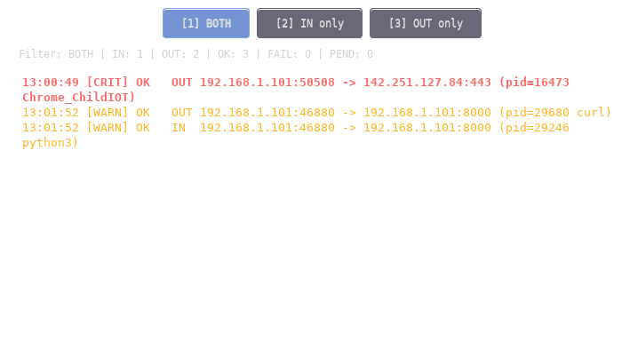

# 🛡️ NetWatch

> Lightweight network security tool that monitors TCP connections in real-time using eBPF. It provides immediate visibility into both incoming and outgoing connections through an unobtrusive transparent overlay, helping you detect suspicious network activity instantly.

[](LICENSE)
[](https://www.gnu.org/licenses/old-licenses/gpl-2.0.html)
[](https://kernel.org)
[](https://en.wikipedia.org/wiki/C_(programming_language))
[](https://ko-fi.com/netwatch)



---

## ✨ Features

- 🔍 **Real-time monitoring** of TCP connections using kernel-level eBPF
- 🎨 **Color-coded severity** (INFO / WARN / CRIT) based on destination port
- ✅ **Connection status tracking** (PENDING → SUCCESS / FAILED)
- 🎯 **Direction filtering** (Inbound / Outbound / Both) via GUI buttons or keyboard shortcuts
- 📊 **Live statistics** in status bar
- 🪟 **Semi-transparent always-on-top overlay** that stays out of your way
- ⌨️ **Keyboard shortcuts** for quick filter switching
- 🔧 **Modern kernel features**: CO-RE eBPF, perf_event, kprobes
- 🚀 **Low overhead** — kernel-side filtering, ~1% CPU usage
- 📦 **Minimal dependencies** — only GTK3 and libbpf

---

## 🎯 Use Cases

- 🛡️ **Security monitoring** — detect unauthorized outbound connections
- 🔍 **Network debugging** — see what your applications are connecting to
- 🐛 **Malware detection** — spot suspicious processes making connections
- 📚 **Learning eBPF** — clean, well-documented example of modern Linux kernel monitoring
- ⚙️ **Development** — verify your apps' network behavior

---

## 📋 Requirements

### System
- **OS:** Linux (Debian 12+ / Ubuntu 22.04+ / Fedora 36+ / Arch)
- **Kernel:** 5.8+ with BTF support (`/sys/kernel/btf/vmlinux` must exist)
- **Display:** X11 with compositor (picom, xcompmgr, compton, or built-in WM compositor)
- **Privileges:** root (required for eBPF)

### Tested Environments
- ✅ Debian 14 (Forky/Sid) with kernel 6.19
- ✅ Openbox + picom (xrender backend)
- ✅ XFCE 4.18 (built-in compositor)

---

## 🚀 Quick Start

### 1. Install dependencies

**Debian / Ubuntu:**

```bash
sudo apt install -y \
    build-essential \
    libbpf-dev \
    libgtk-3-dev \
    libcairo2-dev \
    libx11-dev \
    clang \
    llvm \
    bpftool \
    libelf-dev \
    zlib1g-dev \
    pkg-config
Fedora:

Bash

sudo dnf install -y \
    gcc \
    libbpf-devel \
    gtk3-devel \
    cairo-devel \
    libX11-devel \
    clang \
    llvm \
    bpftool \
    elfutils-libelf-devel \
    zlib-devel
2. Install compositor (if not already running)
If you're using a lightweight WM like Openbox, you need a compositor for transparency:

Bash

sudo apt install picom
picom --backend xrender --no-vsync &
3. Build
Bash

git clone https://github.com/wieczoj/netwatch.git
cd netwatch
make
4. Run
Bash

sudo ./netwatch
5. Test
In another terminal:

Bash

curl http://example.com
You should see entries appearing in the overlay window!

📖 Usage
Command-line options
text

Usage: sudo ./netwatch [OPTIONS]

Options:
  -q, --quiet          Disable debug output on stderr
  -d, --direction DIR  Filter direction (in/out/both), default: both
  -a, --about          Show program info and author
  -h, --help           Show help
Examples
Bash

# Monitor all connections
sudo ./netwatch

# Monitor only outbound connections
sudo ./netwatch -d out

# Monitor only inbound, quiet mode
sudo ./netwatch -d in -q

# Show project info and support links
./netwatch --about
Keyboard shortcuts (in overlay window)
Key	Action
1	Show all connections (BOTH)
2	Show only inbound (IN)
3	Show only outbound (OUT)
Q	Quit application
Color coding
Color	Meaning
🟢 Green	Info (high ports > 49151) - typical client connections
🟡 Orange	Warning (registered ports 1024-49151) - services
🔴 Red	Critical (system ports < 1024) - SSH, HTTPS, DB, etc.
🔴 Red bold underline	Connection FAILED or BLOCKED
⚪ Gray italic	Connection PENDING (in progress)
🔧 How It Works
NetWatch uses eBPF kprobes attached to kernel functions:

Kprobe	Function	Purpose
kprobe/tcp_connect	Outbound connection initiation	Detect new outgoing connections
kprobe/tcp_set_state	TCP state transitions	Track SUCCESS / FAILED status
kretprobe/inet_csk_accept	Inbound connection acceptance	Detect new incoming connections
Events are sent to userspace via perf_event_array map. The GTK3 overlay window displays them with semi-transparency, always staying on top.

⚠️ Known Issues
IPv6 not supported — Currently only IPv4 connections are monitored
TCP only — UDP and ICMP are not tracked
Localhost filtered — Connections to/from 127.x.x.x are hidden by default
Wayland untested — Designed for X11; may not work on pure Wayland
High kernel version requirements — Requires BTF (kernel 5.8+)
Compositor required for transparency — Without compositor, window appears solid black
If you encounter other issues, please open an issue.

🤝 Contributing
Contributions are welcome! Here's how you can help:

🐛 Report bugs via GitHub Issues
✨ Request features via GitHub Discussions
💻 Submit pull requests for fixes or features
📖 Improve documentation
🌍 Spread the word — share with others who might find it useful
💝 Support Development
NetWatch is free and open source. If you find it useful, please consider supporting:

Support on Ko-fi

Why donate?
Your support helps me:

🐛 Fix bugs faster
✨ Implement new features
📚 Improve documentation
🌍 Spend more time on the project
Sponsorship benefits
Donors get priority consideration for feature requests. All features developed for sponsors are eventually open-sourced in NetWatch — there are no proprietary features.

This is a donation-based model, not a paid product. The core functionality remains 100% free and open source forever.

📜 License
NetWatch uses dual licensing:

Component	License	Why
netwatch.c (userspace)	MIT	Permissive, allows commercial use
netwatch.bpf.c (kernel)	GPL v2	Required by Linux kernel for eBPF
You can freely use, modify, and distribute NetWatch in your projects, including commercial ones.

🙏 Acknowledgments
This project would not be possible without:

🐧 Linux kernel developers — for the amazing eBPF infrastructure
📚 libbpf team — for excellent BPF tooling and CO-RE support
🎨 GTK team — for the robust GUI toolkit
📖 Brendan Gregg — for popularizing eBPF tracing techniques
🛠️ libbpf-bootstrap project — for great BPF examples
🔧 bpftrace, bcc — inspiration for kernel monitoring approach
Special thanks to the open source community for years of free knowledge sharing! 💖

📊 Project Status
🟢 Active development — features being added regularly

Current version: **v1.0.0** 

See commit history for recent changes. Issues and PRs are welcome!

👤 Author
Janusz Wieczorek

GitHub: @wieczoj
Ko-fi: ko-fi.com/netwatch
Made with ❤️ for the Linux community

⭐ Star this repo if you find it useful!
